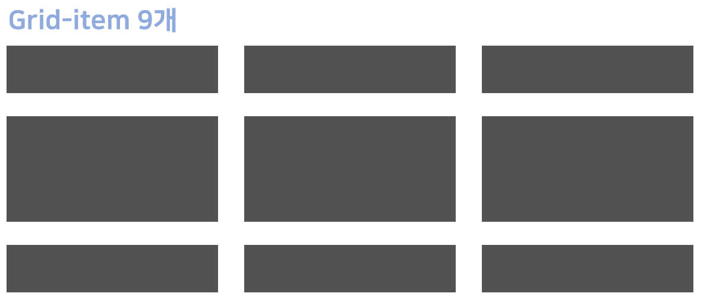
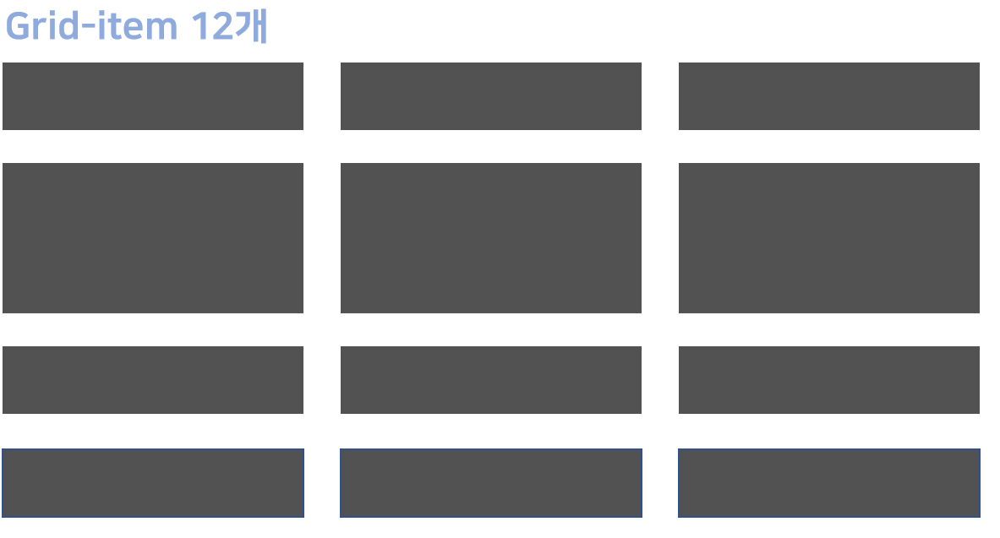
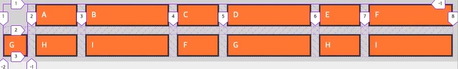

> ### CSS Grid 핵심정리 
>
> - **grid-template-columns(행), grid-template-rows(열)**
> - **grid-auto-rows/grid-auto-columns**

```html
<!DOCTYPE html>
<html>
<head>
	<meta charset="UTF-8">
	<meta name="viewport" content="width=device-width, initial-scale=1.0">
	<meta http-equiv="X-UA-Compatible" content="ie=edge">
	<title>CSS Grid</title>
	<link rel="stylesheet" href="default.css">
	<style>
		.grid-container {
			display: grid;
			grid-template-columns: 100px 300px 200px;
			grid-template-columns: 1fr 2fr 1fr; 
			grid-template-columns: 1fr 500px 1fr;
			grid-template-columns: repeat(3, 1fr);
			grid-template-columns: repeat(3, 1fr 2fr 1fr);

			grid-template-rows:  200px 200px 200px;
			grid-template-rows:  200px 200px;
			height: 80vh;
		}
	</style>
</head>
<body>
	<div class="grid-container"></div>
		<div class="grid-item">A</div>
		<div class="grid-item">B</div>
		<div class="grid-item">C</div>
		<div class="grid-item">D</div>
		<div class="grid-item">E</div>
		<div class="grid-item">F</div>
		<div class="grid-item">G</div>
		<div class="grid-item">H</div>
		<div class="grid-item">I</div>
</body>
```


- **grid-template-columns(행), grid-template-rows(열)**

```
display: grid;
grid-template-columns: 100px 300px 200px; 고정비율
grid-template-columns: 1fr 2fr 1fr; 상대비율
grid-template-columns: 1fr 500px 1fr; 반응형(중간은 고정비율 나머지는 상대비율)
grid-template-columns: repeat(3, 1fr);반복횟수지정 (=1fr, 1fr, 1fr)
grid-template-columns: repeat(3, 1fr 2fr 1fr); 9개 컬럼 지정하는 방법
(1,2,1,1,2,1,1,2,1)
grid-template-rows:  200px 200px 200px;
grid-template-rows:  200px 200px;

폭을 늘이려면 height: 숫자vh;
```

- **grid-auto-rows/grid-auto-columns**

  (**grid-template-columns(행), grid-template-rows(열)**  랑 비교)

```
.grid-container {
	grid-templates-rows: repeat(3, minmax(100px,auto))
}
```



 -> 그래서 나온 개념이 grid-auto-rows/grid-auto-columns**


➥ gird-auto-rows 적용

```css
.grid-auto-rows: {
    minmax(100px, auto)
}
```



→ item 갯수에 구애 받지않고 auto 같이 최소 100px로 유지됨

➥ gird-auto-rows 적용

```css
.grid-container {
    display: grid;
    grid-template-columns; 50px;
    grid-auto-columns: 1fr 2fr;
    gap: 1rem;
}
.grid-item:nth-child(1) { grid-column: 2;}
.grid-item:nth-child(2) { grid-column: 3;}
.grid-item:nth-child(3) { grid-column: 4;}
.grid-item:nth-child(4) { grid-column: 5;}
.grid-item:nth-child(5) { grid-column: 6;}
.grid-item:nth-child(6) { grid-column: 7;}


```


