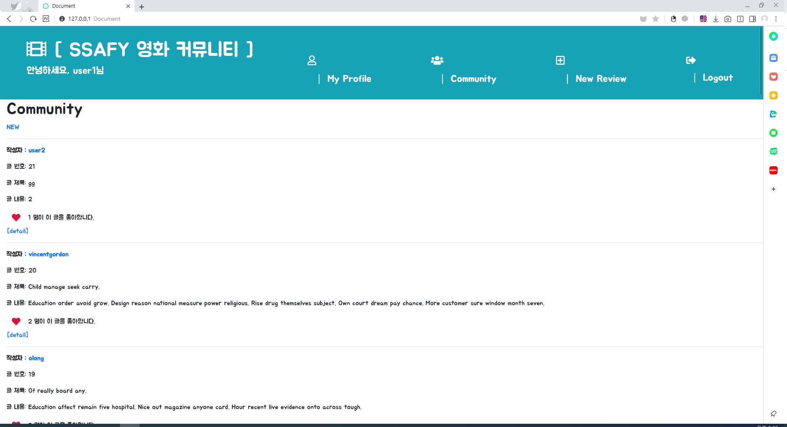
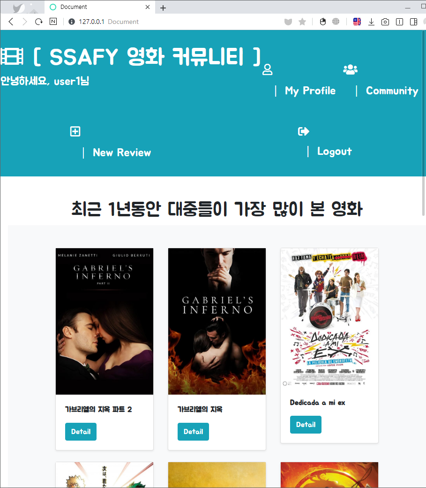
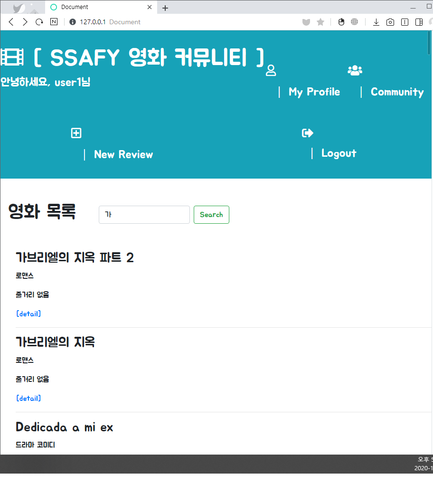
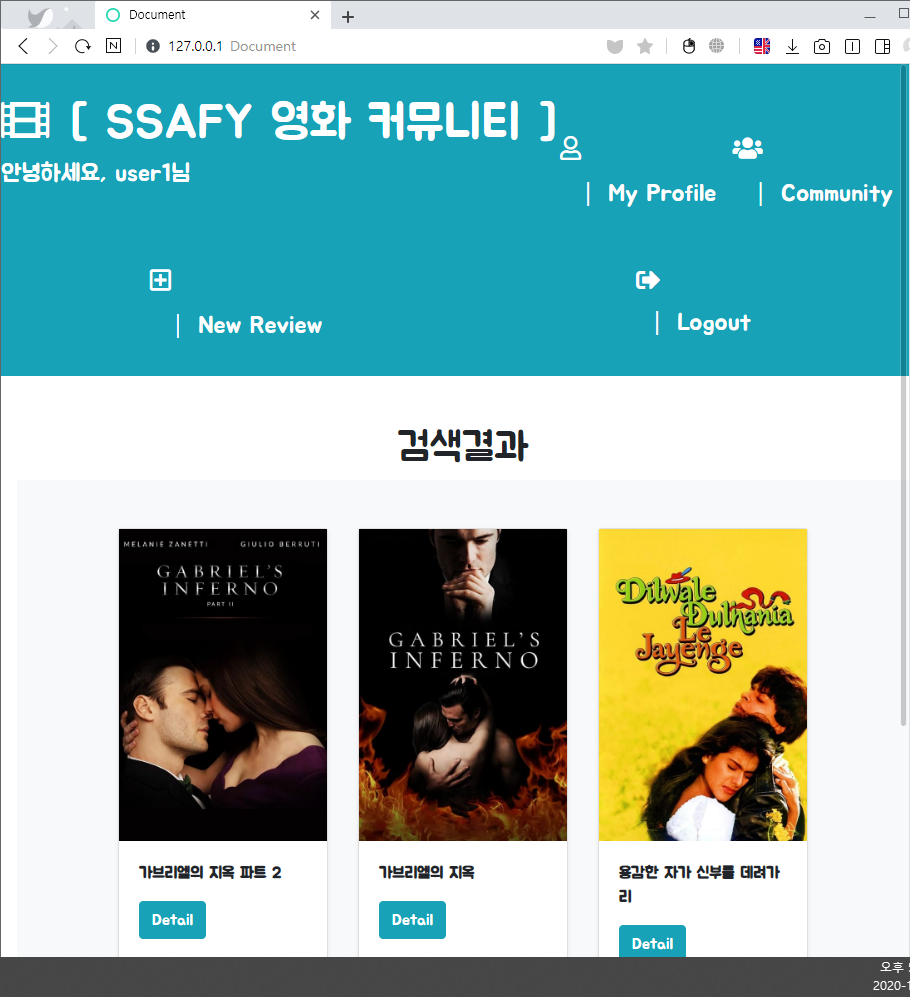

# PJT07


#### 후기

 이번 프로젝트는 드라이버가 세진이가 진행하고 나는 네비게이터 역할을했다.눈과 귀로는 ajax 흐름을 이해했지만 다시 코드를 생각하려고하니까 조금 막막했다. js 언어는 파이썬보다 갈호를 많이쓰고 그 유효범위가 어디까지인지 좀 많이 헷갈린다는 생각이 들었고 실제로 이번주에 수업을 들었을때도 갈호의 범위가 어디까지 영향을 미치는지 헷갈리고 닫는 갈호를 빼먹어서 오류낸 적이 많았다. 그리고 자바스크립트는 dom을 조작하거나 원하는 함수를 구현할려면 발골하듯이 다 정의 해주어야해서 사소한부분에서 놓치는 부분도 많은것 같다. 그리고 html에서는  data- 속성을 사용하여 데이터정보를 가져다써서 이를 JS로 다시 불러올떄 변수명  dataset으로 불러와야한다.  데이터를 불러올때  비슷하지만 각각 문법이 달라서 많이 헷갈렸다!

 

알고리즘을 정말 디테일하게 커스텀해서 추천해주고 싶었으나, 주어진 필드들이 그렇게 막 입맛에 맞게
구현할 수 있는 항목들이 아니라서 조금 아쉬웠다. 단순하게 order.by로 평점 많은순, popularity 등 인기도를 나타내는 지표 하나로만 구현해도 되었지만 내가 실제로 유저입장이 되어 본 입장을 고려해보기도하고 db를 보니 
최신영화가 많이 없다는걸 알게 되었다. 그래서 보통 옛날 영화도 스테디하게 보는 경우도 있지만 
트렌드를 무시할 수 없다는 생각에 최근 1년이내 라는 조건과 인기도 지표를 활용하면 좀더 유저입장에서
매력적으로 다가갈 수 있다고 생각했다. 그래서 유저가 그 영화 페이지를 방문한 시점에서 일년이내를 들고올려면
라이브러리가 필요하다는 생각이들었고 텔레그램 파이썬봇 배울때 datetime 을 import를 한 경험을 살리니
원하는대로 구현되었다! 아쉬웠던점은 시간이 좀더 넉넉했으면
각 영화 데이터 항목들을  범위(숫자인경우), 장르종류들을 드롭다운으로 여러개로 만들어 and 조건을 만족하게해서내가 원하는대로 조건을 정해서 GET방식으로 조회해서 영화를 찾고 싶기도했고, 
네브바에 a 태그를 여러개 넣어서 각항목에 여러가지 알고리즘을 각각 적용해서 페이지가 렌더링 되게끔도 하고싶었지만 다음기회에 한번 적용하고싶기도 하고, 감독데이터가 있었으면 권위있는 영화제에 큰상을 받을 감독(봉준호)의 정보도 외부에서 끌고와서 이를 활용해서 영화를 추천하는 알고리즘도 만들고 싶다!


#### 기본작업

1. 가상환경설치

2. `pip install -r requirements.txt`

3. migrate 진행.

4. `python manage.py loaddata movies.json`으로 json 데이터를 db에 저장.

5. django-seed 설치 후 pip freeze 후 settings.py 에서 app 등록.

   이 때, seed를 설치할 때는 `pip install django-seed` 이고 settings.py에 등록할 때는 `'django_seed'` 를 추가해야 하니 주의하자.

6. `python manage.py seed community --number=20` 으로 community에 review를 20개 정도 생성하였다.

___




#### base.html

1. block script 구분을 해주고 axios 를 사용할 것이기에 axios github에 있는 cdn을 복사해서 추가해 준다. 그리고 script는 block으로 지정해 주도록 한다.

   이 때, 반드시 cdn 하단에 block을 지정해 준다.
   
   ```javascript
   <script src="https://cdn.jsdelivr.net/npm/axios/dist/axios.min.js"></script>
     
    
   ```


#### JAVASCRIPT (좋아요 기능) (community/index.html)

1. base.html을 상속받고 block script를 통해 script를 작성한다.

   ```javascript
   
   <script>
       ...
   </script>
   
   ```

   

2. post 응답을 받아올 것이기에 csrftoken값을 받아 headers에 넣어줘야한다.

   ```javascript
   const csrftoken = document.querySelector('[name=csrfmiddlewaretoken]').value
   const headers = {
       headers: {
         'X-CSRFToken': csrftoken
       },
   }
   ```

3. post 요청을 보냈을 때 페이지가 넘어가지 않도록 preventDefault()를 해준다.

4. 전체 index에서 보여줄것이기에 forEach를 사용했고 각각의 form 요소들에 접근하기 위해서 data-pk 값을 설정해 주고 백틱을 이용해서 접근해 주었다.

5. axios응답을 받아와야되기 때문에 views.py에서 JsonResponse를 import 해주고 좋아하는지 여부(liked)와 좋아하는 사람수(liked_cnt)를 context로 받아와 JsonResponse값을 return 해준다.

6. axios.post 응답을 받고 성공했을 때(.then) 좋아하는지 여부에 따라서 i tag 값의 색을 변경해 주었다. likeBtn.style.color 를 통해 color 값을 지정해 줄 수 있다.

   ```javascript
   ...
       likeBtn.style.color = 'crimson'
   } else {
       likeBtn.style.color = 'black'
   }
   ```

7. 마지막으로 jsonresponse로 받아온 좋아요를 한 사람의 수를 반영해 innerText값을 변경해 준다.


#### JAVASCRIPT (팔로우 기능)

1. _follow.html과 profile.html을 이용해 작업을 진행한다.

2. profile.html 하단에 block script를 삽입한 후 script 작업을 시작한다. (좋아요와 동일)

3. 좋아요와 마찬가지로 팔로우도 form에서 post 요청을 보낸 후 views.py에서 동작하기 때문에 post 요청을 하기 위해 csrftoken값을 headers에 넣은 다음 axios.post 요청을 보내야 한다.

4. axios를 통해 jsonresponse를 받아오기 위해 views.py로 이동한다.

5. `from django.http import JsonResponse`를 하고 코드 작성에 필요한 팔로우 여부와 팔로윙하는 사람의 수, 팔로우하는 사람의 수를 return해준다.(json 형태로)

6. follow 버튼의 id를 follow-form으로 지정해 주고 `document.querySelector('#follow-form')` 으로 followForm을 지정해 준다.

7. axios 응답을 성공적으로 받아왔을때 `.then` 팔로우 상태에 따라 버튼의 class 속성을 변경해 주었다.

   class 속성을 삭제하는 경우는 remove, 추가하는 경우는 add로 추가한다.

   ```javascript
   followBtn.classList.remove('btn-primary')
   followBtn.classList.add('btn-secondary')
   ```
   
8. 마지막으로 팔로윙과 팔로우하는 사람의 수도 변경해 주도록 한다. 좋아요때와 마찬가지로 여기서 받아온 Tag의 innerText 값을 설정해 주면 된다.


#### 추천 기능 (movies/recommended/)



1. movies/models.py에 정의된 Movie는 다음과 같다.

   ```python
   class Movie(models.Model):
       title = models.CharField(max_length=100)
       release_date = models.DateField()
       popularity = models.FloatField()
       vote_count = models.IntegerField()
       vote_average = models.FloatField()
       overview = models.TextField()
       poster_path = models.CharField(max_length=200)
       genres = models.ManyToManyField(Genre)
   ```

   

2. 여기서 개봉일에 해당하는 release_date는 DateField()임을 확인할 수 있다.

3. 여기서 우리조는 개봉일(release_date) 기준 1년전인 최신영화에서 평균평점(vote_average)을 내림차순으로 정렬하여 10명을 뽑기로 하였다.

4. release_date를 print(type(movie.release_date))를 찍어보니 데이터 타입이 `datetime` 임을 확인할 수 있었다.

5. 따라서 오늘 날짜를 받아오고 그 날짜에서 1년전 날짜를 `datetime` 타입으로 값을 저장하고 값을 비교하는 식으로 `release_date` 를 이용해 filter를 할 수 있었다.

   ```python
   import datetime
   
   // 오늘날짜를 받아온다.
   today = datetime.datetime.today()
   // datetime.date( 년, 월, 일 ) 을 통해 datetime 타입을 생성할 수 있다. 여기서 개봉일이 1년전인 날짜 정보가 필요하기 때문에 today_compare라는 변수에다가 datetime.date를 지정해 주었다.
   today_compare = datetime.date(today.year-1, today.month, today.day)
   ```

   

6.  filter 속성으로 release_date(개봉일)이 1년전(today_compare)과 비교해서 이상(__gte)인 것들을 vote_average) order_by를 통해 10명을 뽑아왔다.

   ```python
   movies = Movie.objects.filter(release_date__gte=today_compare).order_by('-vote_average')[:10]
   ```

7. Template에서는 Bootstrap의 card를 이용해 만들기로 했다. Bootstrap을 이용하였고 flex와 grid system을 이용해 한줄에 3개씩 보이도록 설정해 주었다. card에는 영화 poster와 title 그리고 Detail Page로 이동할 수 있도록 버튼을 생성하였다.

8. 따로 /movies/recommended/ 로 이동할 수 있는 수단이 없기에 movies index 페이지에서 `[SSAFY 영화 커뮤니티]` 를 클릭하면 recommended 페이지로 이동할 수 있도록 링크를 걸어주었다.


#### 추가 기능





1. search를 통해 영화 제목(title)의 값이 포함되어있으면(contains로 해도되는데 icontains를 통해 대소문자 구분없이 검색하도록 하였습니다.) 그 결과 값들을(평점순으로 정렬해서) 화면에 보여주는 기능을 구현해 보았습니다.

2. 검색하는 search form을 /movies/ 페이지에 표시해 주었습니다.

   ```html
   // movies/index.html
   <div class="d-flex mt-5 mb-5">
       <h1>영화 목록</h1>
       <form action="" class="form-inline d-inlin ml-5">
           <input class="form-control mr-sm-2" type="search" placeholder="Search" aria-label="Search" name="title">
           <button class="btn btn-outline-success my-2 my-sm-0" type="submit">Search</button>
       </form>
   </div>
   ```

   

3. movies/urls.py에 search를 추가해 주었습니다.

   ```python
   # urls.py
   ..
   path('search', views.search, name='search'),
   ..
   ```

   

4. movies/views.py

   ```python
   # views/py
   
   def search(request):
       title= request.GET.get('title')
       movies = Movie.objects.filter(title__icontains=title).order_by('-vote_average')
       context = {
           'movies': movies,
       }
       return render(request, 'movies/search.html', context)
   ```

   

5. movies/search.html은 recommended.html와 동일하게 구현하였습니다.

___

#### 


.