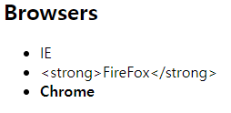

> # JavaScript 이론정리

###  

> ### Javascript 배경 및 역할

- Javascript는 브라우저를 동적으로 사용하기 위해 고안된 언어이다.

- Java의 유명세를 얻기 위해 지어진 이름일뿐, 둘은 전혀 관련 및 유사성이 없다. 문법은 둘다 C와 유사하다.

- ECMA Script(ES)는 브라우저마다 파편화 되어가는 JS 생태계를 묶기 위해 ECMA가 제시한 표준안

  - 즉 ES6는 ECMA가 제안하는 JS의 표준 Ver.6라는 의미!

- IE는 HTML5 표준과 ES6 표준 두가지 모두 매우 안지킨다.

- 브라우저 콘솔에서 바로 사용할수 있는 JS를 Vanila JS라고 부른다. (Vanilla 아이스크림 === 순정)

  -  Vanilla JS 는 프로그래밍을 통해 BOM 조작, DOM 조작을 할 수 있다.
  - 어떠한 라이브러리/프레임워크에도 의존하지 않는 Original Brrowser JS라고 할 수 있음

- 브라우저라는 제한된 환경을 넘어 브라우저 밖(컴퓨터)에서 JS를 구동할 수 있는 새로운 실행 환경이 Node.js가 등장한다. (Node.js환경에서는 당연히 DOM, BOM 조작불가능)

  - FE 프로그래밍 뿐만 아니라 서버를 JS로 구추갛려는 개발자들의 수요가 생기면 2009년 달에 의해 브라우저 밖에서 JS를 구동할 수 있는 새로운 JS 실행환경인 Node.js가 등장
  - V8 엔진을 기반으로 제작, Node.js의 등장을  통해 JS만으로 클라이언트-서버를 모두 제작가능

  ####  Javascirpt의 파편화와 표준화

  - 브라우저 전쟁의 결과로 크로스 브라우징 이슈 발생했고 그 결과가 현재까지도 많은 영향을 주고 있다.

    - 크로스 브라우징 이슈: 브라우저별로 따로  FE를 따로 구현해야하는 크로스 브라우징 이슈가 발생, 모든 브라우저에서 동작하는 동적인 웹 페이지 갭라이 어려워졌다

  - JavaScript는 파편화된 요소가 하나의 표준으로 정립되는 과정을 이해하며 접근해야 한다.

    

  #### JavaScript로 할 수 있는 것

  계산, 저장 , 반복, 분기 등의 일반적인 프로그래밍 언어가하는 일들 할 수 있다. JS가 등장한 이유는 BOM과 DOM을 프로그래밍을 통해 조작하기 위해서다. 

  - DOM(Document Object Model) 조작 :

    - DOM: HTML, XML등과 같은 문서를 다루기 위한 독립적인 문서 모델 인터페이스
    - 모든 문서의 노드는 DOM Tree 라고 불리는 트리 구조의 모습을 갖는다
    - `window`, `document`와 같은 객체들이 존재하는데, `window`는 브라우저의 최상의 객체를 의미하며 생략가능

    - 문서(HTML)를 객체로 조작

  - BOM(Browser Object Model) 조작
  - ECMA Script
    - 프로그래밍 언어로 할 수 있는 것: 변수, 타입, 조건문, 반복문, 함수

---

> ### JS 불러오는 방법

1.

```javascript
<body>
  <script>
    // 1. html에 script 태그 만들어서 작성
  </script>
</body>
```

2.

```javascript
<body>
  <!-- 2. html에 script 태그 내부에 src 속성으로 파일을 불러와서 작성 -->
  <script src="index.js"></script>
</body>
```

3.

```javascript
<body>
   <!-- 3. onclick -> inline으로 사용할 수 있지만 권장하지 않음 inline styling을 권장하지 않는 것과 동일 -->
 <button onclick="alertMessage()">나를 눌러봐!</button>
    
 <script>
   //3. onlclick
   const alertMessage = function () {
      alert('안녕하세요!')
   }
 </script>
</body>
```


> ### JS 문법 [1] (요소 생성, 변경, 삭제, 추가, 스타일링 등)

- 단일 노드

  `document.querySlector(selector)` : id, class, tag, 복합선택자(자손, 자식선택자)등을 모두 활용하여 선택할 수 있다.

- 여러개의 요소

  `document.querySelectorAll(selector)`

- DOM 태그 만들기

  ```javascript
  const browserHeader = document.createElement('h2')
  const ul = document.createElement('ul')
  const li1 = document.createElement('li')
  const li2 = document.createElement('li')
  const li3 = document.createElement('li')
  ```

  

- 새로 만든 태그에 내용 넣기

  ```javascript
  browserHeader.innerText = 'Browsers'
  li1.innerText = 'IE'
  li2.innerText = '<strong>FireFox</strong>'
  li3.innerHTML = '<strong>Chrome</strong>'
  ```

  - innerText 와 innerHTML

    **innerText** 는 문자열 그대로를 리턴하는 반면, **innerHTML** 은 태그를 적용시켜, 즉 문자열을 html로 인식하여 리턴한다

  

- DOM 에 추가하기

  ```java
  //body에 추가해야 document에서 보여짐
  const body = document.querySelector('body')
  body.appendChild(browserHeader)
  body.appendChild(ul) //빈값으로 나옴 ul 에 따로 추가한거 없음
  ```

  

- append와 appendChild의 차이점 

  ```javascript
  ul.append(li1, li2, li3) // 갈호안에 전체를 다 추가하겠다
  ul.appendChild(li1, li2, li3) // 갈호안에 제일 첫번째 요소만 추가하겠다.
  ```

- Delete

  ```javascript
  ul.removeChild(li1) // 갈호안에 제일 첫번쩨 요소만 삭제
  ul.removeChild(li2) // 갈호안에 제일 첫번쩨 요소만 삭제
  ```

- remove

  ```javascript
  ul.remove() // ul이 여러개라면 id로 구분하고 변수도 구분해서 변수선택해서 삭제가능
  body.remove() // 위와 동일
  ```

- element styling

  ```javascript
  li1.style.cursor = 'pointer' //요소에 마우스 갖다되면 손모양으로 바뀜
  li2.style.color = 'blue'
  li3.style.background = 'red'
  ```

  

- setAttribute

  ```javascript
    <style>
       #king {
        color: black;
      }
    </style>
  li1.style.cursor = 'pointer' //요소에 마우스 갖다되면 손모양으로 바뀜
  li2.style.color = 'blue'
  li3.style.background = 'red'
  
  li3.setAttribute('id', 'king') // 배경색은 red이고 글자색깔은 검정색인 스타일로 적용됨 
  // <li id="king"> --- </li>
  ```

  

- getAttribute

  ```javascript
  const getAttr = li1.getAttribute('style') 
  // 상단[setAttribute] li1의  style 정의한걸 들고오겠다 (id, class, value 등 여러가지 들고올수있음)
  const getAttr2 = li3.getAttribute('style')
  console.log(getAttr)
  console.log(getAttr2)
  ```


- `element.style.color` & `element.style.textDecoration`

  - `element.style.color`

    상단참고

  - `element.style.textDecoration`

  ```javascript
  // 예시
  li2.style.textDecoration='green wavy underline'
  ```

  ​	

---


> ###  JS 문법 [2] (event)


#### addEventListener

- 특정 이벤트가 발생하면, 할 일을 등록하자!

```javascript
EventTarget.addEventListner(type, listener)
```

1. EventTarget: 이벤트 감지를 위한 요소
2. addEventListener: EventTaget에 이벤트를 등록할 때 사용하는 이벤트 핸들러
3. type: 이벤트의 종류
4. listener :콜백함수, 이벤트가 발생하면 실행되는 함수

#### event.preventDefault()

- 각 태그의 고유한(==기본으로 설정된)이벤트가 브라우저에서 동작하지 않도록 막는 행위)

  - 해당 이벤트의 기본 동작을 확인하고

  - 기본 동작을 막아보자

- cancelable -> 이벤트가 취소 가능한지 여부를 true/false로 반환

  ```java
    <!-- 1. checkbox -->
    <input type="checkbox" id="myCheckBox">
    <hr>
  
    <!-- 2. submit -->
    <form action="/articles/" id="myForm">
      <input type="text">
      <input type="submit">
    </form>
    <hr>
  
    <!-- 3. link -->
    <a href="https://google.com" target="_blank" id="myLink">GoToGoogle</a>
    <hr>
  
    <!-- 4. input -->
    <input type="text" id="myInput">
    
  ====================
      //1. checkbox
      const checkBox = document.querySelector('#myCheckBox')
  
      checkBox.addEventListener('click', function (event) {
      // cancelable -> 이벤트가 취소 가능한지 여부를 true/false로 반환
        console.log(event)
        console.log(event.cancelable)
        event.preventDefault()
      })
      
      //2. form
      const form = document.querySelector('#myForm')
  
      form.addEventListener('submit', function (event) {
        console.log(event)
        console.log(event.cancelable)
        event.preventDefault() 
      // event.target.reset() // value 값 초기화
      })
  ===================
           
  ```

  ```
  cancelable:True
  - checkbox <-> click
  - form <-> submit
  - link <-> click
  - input <-> keydown
  cancelable:False
  - document <->scroll
  
  ```

  

> ## JS문법[2] (handout)

### 


> ## JS실습[1] (Todo CRUD)


### Flow

- Create: todo 요소 생성

- Read: todo 요소가 DOMDP 부착
- Update: todo 요소를 클릭하면 취소선이 토글
- Delete: `x` 버튼을 누르면 todo 삭제