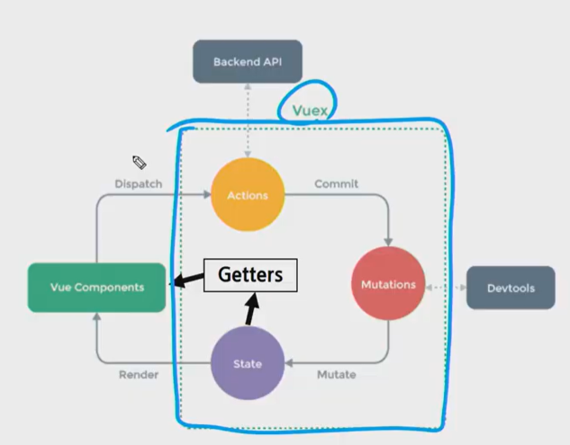

> ### Vuex

- 상태관리를 위한 패턴이자 라이브러리

- 컴포넌트간의 데이터를 더 효율적으로 전달하고 관리하고자  데이터 통신을 한 곳에서 중앙 집중식으로 관리함.

- 상태관리 패턴

  

- state: 컴포넌트간 공유하는 data

- action: 사용자의 입력에 따라 실행하는 메소드(비동기적인 동작)

- mutation: state를 변경하는 메소드(동기적인 동작)

  

