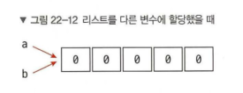

> # **리스트 메소드**

#### **리스트 요소 추가하기**

- append: 요소 하나를 추가

- extend: 리스트를 연결하여 확장

- insert: 특정 인덱스에 요소 추가

  > ## **append**

  - **append(요소)**는 리스트  끝에 **요소 하나**를 추가합니다. 

  - 메서드를 호출한 리스트가 변경되며 새리스틑 생성되지  않음

  ```python
  #형식
  append(요소)
  ```

  ```python
  #예제1: 리스트에 500 추가하기
  a = [10, 20, 30]
  a.append(500)
  print(a)
  
  #실행결과
  [10, 20, 30, 
  500]
  4
  ```

  ```python
  #에제2: 빈 리스트에도 값 추가가능
  a = []
  a.append(10)
  print(a)
  
  #실행결과
  [10]
  ```

  ```python
  #예제3:리스트안에 리스트 추가하기
  a = [10, 20, 30]
  a.append([500, 600])
  print(a)
  print(len(a))
  
  #실행결과
  [10, 20, 30, [500, 600]]
  4
  ```

  > ## **extend:리스트 확장**

  - 리스트에 요소를 여러개 추가할때, append를 여러번 사용하는 방법도 있지만, 추가할 요소가 많은 경우에 사용
  - 리스트 끝에 다른 리스트를 연결하여 리스트를 확장합니다.
  - 메소드를 호출한 리스트가 변경되며 새 리스트는 생성되지 않음
  - 리스트와 리스트를 연결한 모양

  ```python
  #형식
  extend(리스트)
  ```

  ```python
  a = [10, 20, 30]
  a.extend([500, 600])
  print(a)
  print(len(a))
  
  #실행결과
  [10, 20, 30, 500, >600]
  5
  ```

  > ## insert:리스트의 특정 인덱스에 요소 추가

  - append, extend는 리스트 끝에 요소를 추가, **원하는 위치에 요소를 추가하는 방법이 insert**
  - *insert(인덱스, 요소)는 리스트의 특정 인덱승 **요소 하나**를 추가

  ```python
  #형식
  insert(인덱스, 요소)
  ```

  ```python
  #예시1
  a = [10, 20, 30]
  a.insert(2, 500)
  print(a)
  print(len(a))
  
  #실행결과
  [10, 20, 500, 30]
  4
  ```

  ```python
  #예시2
  a = [10, 20, 30]
  a.insert(1, [500, 600])
  print(a)
  
  #실행결과
  [10, [500, 600], 20, 30]
  ```

  ```python
  #에시3: 리스트 중간에 요소 여러개 추가하는 방법
  a = [10, 20, 30]
  a[1:1] = [500, 600] 
  #시작인덱스와 끝 인덱스를 같게 지정하면 해당 인덱스의 요소를 덮어쓰지않고 추가가능
  print(a)
  
  #실행결과
  [10, 500, 600, 20, 30]
  ```

  

  

  **※ insert 자주 사용하는 패턴**

  - insert(0, 요소): 리스트의 맨 처음에 요소를 추가
  - insert(len(리스트), 요소): 리스트 끝에 요소를 추가

  ```python
  #예제: insert(0, 요소): 리스트의 맨 처음에 요소를 추가
  a = [10, 20, 30]
  a.insert(0, 500)
  print(a)
  
  #실행결과
  [500, 10, 20, 30]
  
  ```

  

  ```python
  #예제:insert(len(리스트), 요소): 리스트 끝에 요소를 추가
  a = [10, 20, 30]
  a.insert(len(a), 500) #a.append(500)과 동일
  print(a)
  
  #실행결과
  [10, 20, 30, 500]
  
  ```

#### **리스트에서 요소 삭제하기**

- pop: 마지막 요소 또는 특정 인덱스의 요소를 삭제

- remove: 특정 값을 찾아서 삭제

  > ## pop:리스트에서 특정 인덱스의 요소를 삭제하기

  - pop()은 리스트의 마지막 요소를 삭제한 뒤, 삭제한 요소를 반환합니다.

  ```python
  #형식
  a.pop()
  a.pop(인덱스) 
  ```

  

  ```python
  #예제1
  a = [10, 20, 30]
  print(a.pop())
  print(a)
  
  #실행결과
  30
  [10, 20]
  
  ```

  ```python
  #예제2
  a = [10, 20, 30]
  print(a.pop(1))
  print(a)
  
  #실행결과
  20
  [10, 30]
  ```

  ## ※ del

   pop대신 del 사용가능

  ```python
  a = [1, 2, 3]
  del a[1]
  print(a)
  
  #실행결과
  [1, 3]
  ```

  > ## **remove**

  - pop이나 del은 인덱스로 삭제했는데, 리스트에서 원하는 값을 찾아서 삭제하고 싶을때 사용

  ```python
  #형식
  remove(값)
  ```

  ```python
  a = [10, 20, 30]
  a.remove(20)
  print(a)
  
  #실행결과
  [10, 30]
  ```

  ```python
  a = [10, 20, 30, 20]
  a.remove(20)
  print(a) # 값이 여러개 있을 경우 처음 찾은 값을 삭제합니다.
  
  #실행결과
  [10, 30, 20]         
  ```

  

#### **그 외 리스트 메소드**

>  ### **index: 리스트에서 특정 값의 인덱스 구하기**

- **index(값)**은 리스트에서 특정 값의 인덱스를 구합니다. 같은 값이 여러개일 경우 처음 찾은 인덱스를 구합니다.(가장 작은 인덱스)

  ```python
  a = [10, 20, 30, 15, 20, 40]
  print(a.index(20))
  
  #실행결과
  1
  ```

  

  

> ### count: 특정값의 개수 구하기

- **count(값)**은 리스트에서 특정 값의 개수를 구합니다. 

  ```python
  a = [10, 20, 30, 15, 20, 40]
  print(a.count(20))
  
  #실행결과
  2
  ```

  

> ### reverse: 리스트의 순서를 뒤집기

- reverse()는 리스트에서 요소의 순서를 반대로 뒤집습니다.

  ```python
  a= [10, 20, 30, 15, 20, 40]
  a.reverse()
  print(a)
  
  #실행결과
  [40, 20, 15, 30, 20, 10]
  ```

  

> ## **sort: 리스트의 요소를 정렬하기**

- sort()는 리스트의 요소를 작은 순서대로 정렬합니다. (오름차순)

- sort()또는 sort(reverse=False): 리스트의 값을 작은 순소대로 정렬(오름차순)

- sort(reverse:True):리스트의 값을 큰 순서대로 정렬(내림차순)

  ```python
  a= [10, 20, 30, 15, 20, 40]
  a.sort()
  
  #실행결과
  [10, 15, 20, 20, 30, 40]
  ```

### **※sort 메서드와  sorted 함수**

파이썬은 리스트의 메서드뿐만 아니라 내장함수 sorted도 제공함, sort와 sorted 모두 정렬을 해주는 함수지만 

차이점은 sort는 메서드를 사용한 리스트를 변경하지만, sorted 함수는 정렬된 새리스트를 생성함

```python
a = [10, 20, 30, 15, 20, 40]
a.sort() #a의 내용을 변경하여 정렬
print(a)

b = [10, 20, 30, 15, 20, 40]
sorted(b) # 정렬된 새 리스트를 생성
```

> ### **clear: 리스트의 모든 요소를 삭제하기**

- clear()는 리스트의 모든 요소를 삭제합니다.

  ```python
  a = [10, 20, 30]
  a.clear()
  print(a)
  
  #실행결과
  []
  ```

  ### **※ del**

  ```python
  a = [10, 20, 30]
  del a[:]
  print(a)
  
  #실행결과
  []
  ```

  

> ### **리스트를 슬라이스로 조작하기**

``` python
#예제1: 슬라이스 & len()

a = [10, 20, 30]
a[len(a):] =[500] #a.append(500)과 동일
print(a)

#실행결과
[10, 20, 30, 500] 

#에제1-1
a = [10, 20, 30]
a[len(a):] = [500, 600]
print(a)

#실행결과
[10, 20, 30, 500, 600]

```


> ### **리스트의 할당과 복사 알아보기** (p.293)

할당과 복사는 다름

```python
#1 할당
a = [0, 0, 0, 0, 0]
b = a
print(a is b)


#실행결과
True
```



```python
#2 복사
a = [0, 0, 0, 0, 0]
b = a.copy()
print(b)
print(a is b)
print(a == b)
b[2] = 99
print(a)
print(b)

#실행결과
[0, 0, 0, 0, 0]
False
True
[0, 0, 0, 0, 0]
[0, 0, 99, 0, 0]

```

> ###  **인덱스와 요소를 함께 출력하기**

- **for 인덱스, 요소 in enumerate(리스트):**
- **for 인덱스, 요소 in enumerate(리스트,  start=1):**

```python
#예제1
a = [38, 21, 53, 62, 19]
for index, value in enumerate(a):
	print(index, value)
    
#실행결과
0 38
1 21
2 53
3 62
4 19

#예제2: 인덱스를 1부터 출력하고싶을 때
a = [38, 21, 53, 62, 19]
for index, value in enumerate(a):
	print(index+1, value)
   
#실행결과
1 38
2 21
3 53
4 62
5 19

#예제3: start 이용하기
a = [38, 21, 53, 62, 19]
for index, value in enumerate(a, start = 1): # start 없이 (a, 1) 도 가능
	print(index, value)
    
#실행결과
1 38
2 21
3 53
4 62
5 19


```


> ### **for 반복문에서 인덱스로 요소를 출력하기**

```python
a = [38, 21, 53, 62, 19]

for i in range(len(a)):
	print(a[i])
    
#실행결과
38
21
53
62
19
```

=> for i in range(len(a))를 실행하면 i에는 요소가 아닌 0부터 마지막 인덱스까지 인덱스가 들어감


> ### **while 반복문으로 요소 출력하기**

```python
a = [38, 21, 53, 62, 19]
i = 0
while i <len(a):
    print(a[i])
    i+=1
```

```python
#실행결과
38
21
53
62
19
```


> ### **리스트의 가장 적은 수, 가장 큰 수, 합계구하기**

- #### 가장 작은 수와 가장 큰 수 구하기

  - **for문 활용**

  ```python
  a = [30, 21, 53, 62, 19]
  smallest = a[0]
  for i in a:
      if i < smallest:
          smallest = i
  print(smallest)
  
  #실행결과
  19
  ```

  ```python
  a = [38, 21, 53, 62, 19]
  largest = a[0]
  for i in a:
  	if i > largest:
      	largest = i
  print(largest)
  
  #실행결과
  62
  
  ```

  - **sort 활용** 

  ```python
  # 가장 작은 수
  a = [30, 21, 53, 62, 19]
  a.sort()
  print(a[0])
  
  #실행결과
  19
  
  
  #가장 큰수
  a = [30, 21, 53, 62, 19]
  a.sort(reverse= True)
  print(a[0])
  
  #실행결과
  62
  ```

  

- #### **요소의 합계 구하기**

  - **for문 활용**

  ```python
  a = [30, 21, 53, 62, 19]
  total = 0
  for i in a:
      total += i
  print(total)
  
  #실행결과
  185
  ```

  - **sum 활용**

  ```python
  a = [30, 21, 53, 62, 19]
  print(sum(a))
  
  #실행결과
  185
  ```

- **리스트에 map 사용하기**

  - **list(map(함수, 리스트))**

  - **tuple(map(함수, 튜플))**

  ```python
  #예제1
  a = [1.2, 2.5, 3.7, 4.6]
  a = list(map(int, a))
  print(a)
  
  #실행결과
  [1, 2, 3, 4]
  
  ```

  ```python
  #예제2
  a = list(map(str, range(10)))
  print(a)
  
  #실행결과
  ['0', '1', '2', '3', '4', '5', '6', '7', '8', '9']
  ```

- **input().split()과 map**

  ```python
  #예제1
  a = input().split()
  print(a)
  
  #실행결과
  ['10', '20'] # 문자열 두개가 들어있는 리스트가 만들어짐
  
  ```

  ```python
  #예제2
  a = map(int, input(),split())
  
  print(a)
  print(list(a))
  
  #실행결과
  <map object at 0x000002C6D11291C8>
  [10, 20]
  ```

  ```python
  #예제3
  a, b= [10, 20]
  print(a)
  print(b)
  
  #실헹결과
  10
  20 #a, b = map(int, input()).split())와 같은 동작
  
  
  ```

  

