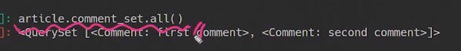

> # CRUD

---

프로젝트 이름: afterschool

앱이름: gumi

---


## ▣ 준비단계

1. master가 보이는경우

OFFICE@OFFICE MINGW64 ~/Desktop/SSAFY_fourth/class/django/online-coaching/Django_OC/bc_0915

**(master)**

---

->git에서 사용  **branch명**


2. venv 가 보이는 경우

**(venv) **

OFFICE@OFFICE MINGW64 ~/Desktop/SSAFY_fourth/class/django/online-coaching/Django_OC/bc_0915

---

-> 가상환경 설정


1. 가상환경 설정

   ```python -m venv venv```

   ```source venv/Scripts/activate``` # 가상환경 수동설정

   (또는 F1->venv 선택)

   `pip list` # package 깨끗한지 보기


2. 장고설치

   `pip install django`


3. 패키지 묶음 박제 및 설치

   - `pip freeze > requirements.txt`  # 파일을 배포하는 입장

     일일히 어떤 패키지를 사용해야하는지 한번에 알수 있고 명령어를 통해서 해당 파일을 실행하기위한 

     패키지모음을 한꺼번에 설치할 수 있음 상기 명령어는 해당 파일을 실행하기위한 패키지를 갱신?박제하WJ는거임

   - `pip install -r requirements.txt` #배포한 파일을 받아서 사용하는 입장

     배포한 파일의 패키지를 한꺼번 설치하는 방법

4. 프로젝트 생성

   `django-admin startproject afterschool`

5. 서버 실행시키기(함정)

   `python manage.py runserver`

   -> 에러발생 현재 카테고리 확인

6. 카테고리 이동

   `ls` -> `manage.py`  있는지 확인, 없으면

   `cd afterschool` (afterschool로 가세요)


 7.앱생성 및 등록

​	**생성**

​	`python manage.py startapp gumi`

​	**등록**

​	`settings.py` : **`'gumi'`**(INSTALLED_APPS)

​	**언어/시간**

​	언어: **en-us**(에러났을때 영어로 설정해놓으면 찾기쉬움) or **ko-kr**

​	시간: Asia/Seoul


8.url 분리

​	[1] 프로젝트 urls.py 에서 분리

​		1) `include` 삽입

​			- `from django.urls import path, include`

​		2) 앱 url 분리(1차)

​			- `path('', include('gumi.urls'))`,

​	[2]  앱 url (*gumi*) 생성

​		1)모듈 import 2) 앱변수 생성 3) urlpatterns 만들기

```python
from django.urls import path

app_name = 'gumi' 
urlpatterns = [

]

```


9.base.html 생성 

​	[1]위치

​		1) 프로젝트 폴더 밑에 or 2) 프로젝트폴더-프로젝트폴더(settings.py랑 나란하게)

​	[2] !+ 탭

​		bootstrap CDN 삽입

​		1) head안에 한개, 2)body에 3줄

​	[3] div 태그, 클래스는 container

​	[4]title은 Gumi AS


10. 템플릿 등록

    1) **settings.py**

    ​	TEMPLATES / DIRS (55번째줄)

    ```python
    'DIRS': [BASE_DIR / 'templates'],
    ```

    

## ▣ Model

1. model data 생성

```python
from django.db import models
from django.conf import settings

# Create your models here.
class Article(models.Model): # 상속
    user = models.ForeignKey(settings.AUTH_USER_MODEL, on_delete=models.CASCADE)
    title = models.CharField(max_length=10)
    content = models.TextField()
    created_at = models.DateTimeField(auto_now_add=True)
    updated_at = models.DateTimeField(auto_now=True)
    
    def __str__(self):
        return self.title


class Comment(models.Model):
    article = models.ForeignKey(Article, on_delete=models.CASCADE)
    user = models.ForeignKey(settings.AUTH_USER_MODEL, on_delete=models.CASCADE)
    content = models.CharField(max_length=200)
    created_at = models.DateTimeField(auto_now_add=True)
    updated_at = models.DateTimeField(auto_now=True)

    def __str__(self):
        return self.content

     
```

 2. 설계도 작성

    ```python manage.py makemigrations```

3. 설계도에 데이터 넣기

   `python manage.py migrate`


## ▣ admin

목적 : admin 사이트를 Student 데이터베이스 테이블 접근가능 (수정, 생성, 삭제)

```python
from django.contrib import admin

from .models import Student, Comment
# Register your models here.

admin.site.register(Article)
admin.site.register(Comment)
```

- 관리자 페이지를 입장하기 위해 계정 생성

  `python manage.py createsuperuser`

- 웹페이지 접속 admin/
  
- 데이터 3개만들기
  
- 데이터를 나타내는 걸 객체로 말고 이름으로 나타낼려면

  `models.py`

  ```python
  class Student(models.Model):
      name = models.CharField(max_length=20)
      age = models.IntegerField()
      address = models.TextField()
  
      created = models.DateField(auto_now_add=True)
      updated = models.DateField(auto_now=True)
  
      def __str__(self):
          return self.name
  ```


## ▣ Urls-Views-Templates

.assets/image-20200916234427617.png)

```python
 
앱이름 구미안에 있는 urls.p에서(app_name) name이 add인 url로 이동
```

 b  

---

## ForeignKey's Arguments on_delete

- CASCADE: 부모객체(참조된 객체)가 삭제되었을 때, 이를 참조하는 객체도삭제
- PROTECT: 참조가 되어있는 경우 오류 발생
- SET_NULL : 부모 객체가 삭제 되었을때 모든 값을 NULL로 치환(NOT NULL 조건시 불가능)
- SET_DEFAULT: 모든 값이 DEFAULT 값으로 치환
- SET() : 특정 함수 호출
- DO_NOTHING: 아무것도 하지 않음.
  - 다만,  데이터베이스 필드에 대한 SQL ON DELETE 제한 조건을 설정해야한다.

- RESTRICT(new in 3.1): RestrictedError 를 발생시켜 참조된 객체의 삭제를 방지

```python
class Comment(models.Model):
    article = models.ForeignKey(Article, on_delete=models.CASCADE)
    #재귀(대댓글) article = models.ForeignKey('self',  on_delete=models.CASCADE)
    #article = models.ForeignKey(Article, on_delete=models.CASCADE)
```

---

초반에 Comment 모델에 article ForeginKey를 안넣어주고 댓글을 생성한 경우 

1. `python manage.py shell_plus`

2. comment.article=article  #객체 통체로 넣어줌(article.pk 안넣어도됨)

3. comment.save() #저장

4. comment.article_id -> 1 #확인, 어느글에 대한 댓글인지 알수있음

   ※ comment.article.pk -> 댓글에 대한 pk (article_pk 안됨!!)

   1) comment.article.title(이댓글의 게시물의 제목을 확인하기위해)

두번째 댓글 만들기

	1. comment = Comment(content = 'second comment', article=article) # 두번째 댓글생성: 내용은 second comment,  ForeignKey 는 article)
 	2. comments #확인
 	3. comment.save()


-> 실제 db열어보면 foreign key 관련 변수는 `article_id` , `abc_id`

★객체표현

```python
del __str__(self)
	return self.title
```


## 역참조

- 모델에 Article에 따로 정의하지 않아도 `모델이름_set`으로 불러올수있음 

  모델이름_set 말고 다름 변수로 부르고 싶으면

  `related_name='comments'` 이런 형태로 정의

  ```python
  class Comment(models.Model):
      article = models.ForeignKey(Article, on_delete=models.CASCADE, related_name='comments')
      #재귀(대댓글) article = models.ForeignKey('self',  on_delete=models.CASCADE)
      #article = models.ForeignKey(Article, on_delete=models.CASCADE)
  ```

  

- 참조당하는 대상이 참조하는 대상을 참조할 때 (각 게시글에 대한 댓글이 뭐뭐있는지 볼떄, Article이 Comment을 참조)

- 예시) 1번글에 있는 댓글  보기 

   1)article =  Article.objects.get(pk=1)

   2)article.comment_set.all()

  

   3)comments = article.comment_set.all()  -> `모델이름_set`형식의 manager를 만든다.

   4)comment.first()

  ​	> <Comment:first comment>

   5)`comments.first(),.content` or `comments[0].content`

  ​	> 'first comment'

## Forms.py

```python
from django import forms
from .models import Article, Comment


class ArticleForm(forms.ModelForm):
    
    class Meta:
        model = Article
        fields = ['title', 'content',]
        # exclude = ['user',]

class CommentForm(forms.ModelForm):

    class Meta:
        model = Comment
        # fields = '__all__'
        exclude = ['article','user',]

```

---


# USER <커스텀 유저 모델>

1. class 유저만들기(models.py

2. AUTH_USER_MODEL

   ```python
   AUTH_USER_MODEL = 'accounts.User'
   ```

3. UserChangeForm, UserCreationForm 커스텀
4. 역참조(comment, Article) 키 생성

---

### 유저 모델 참조하기

- settings.AUTH_USER_MODEL

  ```
  AUTH_USER_MODEL = 'accounts.User'
  ```

  - 유저 모델에 대한 외래키 또는 다대다 관계를 정의할 떄 사용

  - 즉,  models.py에서 유저 모델을 참조할 때 사용

    ```python
    from django.db import models
    from django.conf import settings
    
    # Create your models here.
    class Article(models.Model): # 상속
        user = models.ForeignKey(settings.AUTH_USER_MODEL, on_delete=models.CASCADE) #default=1 (1번유저)
    ```

    

- get_user_model()

  - django는 유저 모델을 직접 참조하는 대신 get_user_model()을 사용하여 유저 모델을 참조하라고 권장

  - 현재 활성(active)유저 모델(지정된 커스텀 유저모델, 그렇지 않은 경우 User)을

  - 즉, models.py가 아닌 다른 모든 곳에서 유저 모델을 참조할 때 사용

    

