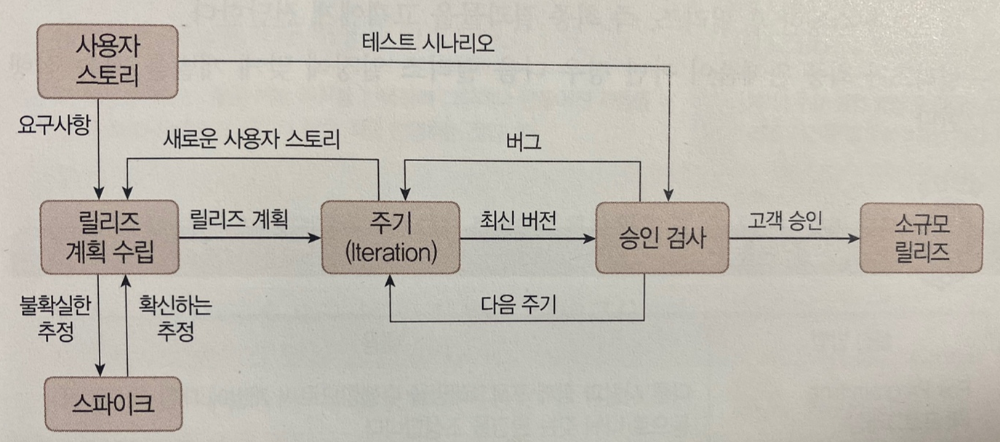

## 1과목 - 소프트웨어 설계

### [1] 요구사항 확인

---

**001. 소프트웨어 생명 주기 **

- 소프트웨어 생명 주기 모형 = 소프트웨어 프로세스 모형 = 소프트웨어 공학 패러다임

- 폭포수모형, 프로토타입 모형, 나선형 모형, 애자일 모형

---

**1) 폭포수 모형**

- 소프트웨어 개발도 이전 단계로 돌아갈 수 없다는 전제하에 각 단계를 확실히 매듭짓고 그 결과를 철저하게 검토하여 승인 과정을 거친 후에 다음 단계를 진행하는 개발 방법론
  - **가장 오래되고 가장 폭넓게 사용되는** 전통적인 소프트웨어 생명주기 모형으로, **고전적 생명주기 모형**
  - 소프트웨어 개발 과정의 **한 단계가 끝나야만 다음 단계로 넘어 갈 수 있는 선형 순차적 모형**
  - 제품의 일부가 될 **메뉴얼**을 작성해야함
  -  각 단계가 끝난 후에는 다음 단계를 수행하기 위한 결과물이 명확하게 산출되어야한다.
  - **두개** 이상의 과정이 병행하여 수행되지 않는다.

- 타당성 검토 -> 계획 -> 요구분석 -> 설계 -> 구현(코딩) -> 시험(검사) -> 유지보수 

**2) 프로토타입 모형(원형)**

- 프로토타입 모형은 사용자의 요구사항을 정확히 파악하기 위해 실제 개발될 소프트웨어에 대한 견본을 만들어 최종 결과물을 예측하는 모형
  - 시제품은 사용자와 시스템 사이의 인터페이스에 중점을 두어 개발한다.
  - 시스템의 일부 혹은 시스템의 모형을 만드는 과정으로서 요구된 소프트웨어를 구현하는데, 이는 추후 구현 단계에서 사용될 골격 코드가 된다.
  - 소프트웨어의 개발이 완료된시점에서 오류가 발견되는 폭포수 모형의 단점을 보완하기 위한 모형이다.

- 프로세스
  - 요구수집 -> 빠른 설계 -> 프로토 타입 구축 -> 고객평가 -> 프로토타입조정 -> 구현

**3) 나선형 모형 (점진적 모형)**

- 나선형 모형은 보헴이  제안한 것으로, 폭포수 모형과 프로토 타입 모형의 장점에 위험 분석 기능을 추가한 모형이다.
  - 나선을 따라 돌듯이 여러번의 소프트웨어개발 과정을 거쳐 점진적으로 완벽한 최종 소프트웨어를 개발하는 것으로, 점진적 모형이라고도 한다.
  - 소프트웨어를 개발하면서 발생할 수 있는 위험을 관리하고 최소화하는 것을 목적으로 한다.
  - 점진적으로 개발 과정이 반복되므로 누락되거나 추가된 요구사항을 첨가할 수 있고, 정밀하며, 유지보수 과정이 필요없다

- 프로세스
  - 계획 및 정의 -> 위험 분석 -> 공학적 개발 -> 고객 평가

**4) 애자일 모형 **

- 애자일은 '민첩한', '기민한' 이라는 의미로, 고객의 요구사항 변화에 유연하게 대응할 수 있도록 일정한 주기를 반복하면서 개발과정을 진행한다.

  - 애자일 모형은 어느 특정 개발 방법론이 아니라 좋은 것을 빠르고 낭비 없게 만들기 위해 고객과의 소통에 초점을 맞춘 방법론을 통칭한다.
  - 애자일 모형은 스프린트 또는 이터레이션이라고 불리는 짧은 개발주기를 반복하며, 반복되는 주기마다 만들어지는 결과물에 대한 고객의 평가와 요구를 적극 수용한다.

  - 각 개발주기에는 고객이 요구사항에 우선순위를 부여하여 개발 작업을 진행한다.
  - 소규모 프로젝트, 고도로 숙달된 개발자, 급변하는 요구사항에 적합하다.
  - 애자일 모형을 기반으로 하는 소프트웨어 개발 모형에는 **스크럼, XP, 칸반,  Lean, 크리스탈, ASD, DSDM, DAD, FDD**

- 애자일 선언

  - 애자일 개발 4가지 핵심 가치
    - 프로세스/도구 보다는 개인과 상호작용을 더 중요시
    - 방대한 문서 보다는 실행되는 SW에 더 가치를 둠
    - 계약협상보다는 고객과 협업에 더 가치를 둔다
    - 계획을 따르기 보다는 변화에 반응하는것에 더 가치를 둔다

  - 애자일 개발 12가지 실행 지침
    - 유여한 소프트웨어를 빠르고, 지속적으로 제공하여 고객을 만족시킨다
    - **개발 막바지라도 요구사항 변경을 적극 수용**
    - 몇 개월이 아닌 몇 주 단위로 실행되는 소프트웨어를 제공한다.
    - 고객과 개발자가 프로젝트 기간에 함께 일한다.
    - 개발에 대한 참여 의지가 확실한 사람들로 팀을 구성하고, 필요한 개발환경과 지원을 제공하며, 일을 잘 끝낼 수 있도록 신뢰한다.
    - 같은 사무실에서 얼굴을 맞대고 의견을 나눈다.
    - **개발의 진척도를 확인하는 1차기준은 작동하는 소프트웨어이다**
    - 지속 가능한 개발을 장려하고 일정한 속도로 개발을 진행한다.
    - 기술적 우수성과 좋은 설계에 지속적인 관심을 기울이면 민첩성이 향상된다.
    - **단순화를 추구한다**
    - 최상의 아키텍쳐, 명확한 요구사항, 최상의 설계는 자기 스스로 일을 주도하는 조직적인 팀으로부터 나온다.
    - 더 효과적인 팀이 될 수 있는 방안을 정기적으로 깊이 고민하고 그에 따라 팀의 행동을 조정한다.

- 폭포수 모형과 애자일의 비교

| 구분                 | 폭포수 모형                 | 애자일                                  |
| -------------------- | --------------------------- | --------------------------------------- |
| 새로운 요구사항 반영 | 어려움                      | 지속적으로 반영                         |
| 고객과의 의사소통    | 적음                        | 지속적임                                |
| 테스트               | 마지막에 모든 기능을 테스트 | 반복되는 일정 주기가 끝날 때마다 테스트 |
| 개발 중심            | 계획, 문서(메뉴얼)          | 고객                                    |

---

**002. 스크럼 기법 **

---

**1) 스크럼의 개요**

- 스크럼이란 럭비에서 반치긍로 경기가 중단된 경우 양 팀의 선수들이 럭비공을 가운데 두고 상대팀을 밀치기 위해 서로 대치해 있는 대형을 말한다. 스크럼은 이처럼 팀이 중심이 되어 개발의 효율성을 높인다는 의미가 내포된 용어이다.
  - 스크럼은 팀원 스스로가 스크럼 팀을 구성해야하며, 개발 작업에 관한  모든 것을 스스로 해결할 수 있어야한다.
  - 스크럼 팀은 제품 책임자, 스크럼 마스터, 개발팀으로 구성된다.

- 제품 책임자(PO : Product Owner)
  - 이해관계자(소프트웨어 개발 의뢰자, 소프트웨어 개발자, 소프트웨어 사용자)들 중에 개발될 제품에 대한 이해도가 높고, 요구사항을 책임지고 의사 결정할 사람으로 선정하는데, 주로 개발 의뢰자나 사용자가 담당한다.
  - 이해관계자들의 의견을 종합하에 제품에 대한 요구사항을 작성하는 주체다.
  - 요구사항이 담긴 백로그(제품 개발에 필요한 요구사항을 모두 모아 우선순위를 부여해 놓은 목록)를 작성하고 백로그에 대한 우선순위를 지정한다.
  - 팀원들이 백로그에 스토리를 추가할 수 는 있지만 우선순위를 지정할 수는 없다.
    - 스토리: 백로그에 담겨질 요구사항은 단어형태로 표현된 것이 아니라, 고객은 상품 주문을 위해 로그인을 수행해야한다 와 같이 이야기를 서술하는 형태로 표현합니다. 그래서 백로그에 작성되는 요구사항을 스토리 또는 사용자 스토리라고 합니다.
  - 제품에 대한 테스트를 수행하면서 주기적으로 요구사항의 우선순위를 갱신한다.

- 스크럼 마스터(SM: Scrum Master)
  - 스크럼 팀이 스크럼을 잘 수행할 수 있도록 객관적인 시각에서 조언을 해주는 가이드 역할을 수행한다. 팀원들을 통제하는 것이 목표가 아니다.
  - 일일 스크럼 회의를 주관하여 진행 사항을 점검하고, 개발과정에서 발생된 장애 요소를 공론화하여 처리한다.

- 개발팀 (DT: Development Team)
  - 제품 책임자와 스크럼 마스터를 제외한 모든 팀원으로, 개발자 외에도 디자이너 ,테스터 등 제품 개발을 위해 참여하는 모든 사람이 대상이 된다.
  - 보통 최대 인원은 7~8명이 적합하다.

**2) 스크럼 개발 프로세스**

- 제품 백로그 (Product Backlog)
  - 제품 개발에 필요한 모든 요구사항을 우선순위에 따라 나열한 목록이다
  - 개발 과정에서 새롭게 도출되는 요구사항으로 인해 지속적으로 업데이트 된다.
  - 제품 백로그에 작성된 사용자 스토리를 기반으로 전체 일정 계획인 릴리즈 계획을 수립한다.

- 스프린트 계획 회의
  - 제품 백로그 중 이번 스프린트에서 수행할 작업을 대상으로 단기 일정을 수립하는 것이다.
  - 스프린트에서 처리할 요구 사항을 개발자들이 나눠서 작업할 수 있도록 테스트라는 작업 단위로 분할한 후, 개발자별로 수행할 작업 목록인 스프린트 백로그를 작성한다.

- 스프린트
  - 실제 개발 작업을 진행하는 과정으로, 보통 2- 4주 정도의 기간 내에서 진행한다.
  - 스프린트 백로그에 작성된 태스트를 대상으로 작업시간(양)을 추정한 후 개발 담당자에게 할당한다.
  - 테스크를 할당할 때는 개발자가 원하는 태스크를 직접 선별하여 담당할 수 있도록 하는 것이 좋다.
  - 개발 담당자에게 할당된 태스크는 보통할일(To Do),  진행중(In Progress), 완료(Done)의 상태를 갖는다.

- 일일 스크럼 회의(Daily Scrum Meeting)
  - 모든 팀원이 매일 약속된 시간에 약 15분 정도의 짧은 시간동안 진행 상황을 점검한다.
  - 회의는 보통 서서 진행하며, 남은 작업시간은 소멸차트에 표시한다.
    - 소멸차트: 해당 스프린트에서 수행할 적업의 진행상황을 확인할 수 있도록 시간의 경과에 따라 남은 작업시간을 그래프로 표현 한것, 초기에 추정했떤 전체 작업 시간은 작업이 진행될수록 점점 줄어들게 됨
  - 스크럼 마스터는 발견된 장애요소를 해결할 수 있도록 도와준다.

- 스프린트 검토 회의
  - 부분 또는 전체 완성 제품이 요구사항에 잘 부합되는지 사용자가 포함된 참석자 앞에서 테스팅을 수행한다.
  - 스프린트의 한 주당 한 시간내에서 진행한다.
  - 제품 책임자는 개선할 사항에 대한 피드백을 정리한 후 다음 스프린트에 반영할 수 있도록 제품 백로그를 업데이트 한다.

- 스프린트 회고
  - 스프린트 주기를 되돌아보며 정해놓은 규칙을 잘 준수햇는지, 개선할 점은 없는지 등을 확인하고 기록한다.
  - 해당 스프린트가 끝난 시점에서 수행하거나 일정 주기로 수행한다.

---

**003. XP 기법**

---

**1) XP**

- XP(eXtreme Programming)는 수시로 발생하는 고객의 요구사항에 유연하게 대응하기 위해 고객의 참여와 개발 과정의 반복을 극대화하여 개발 생산성을 향상 시키는 방법이다.

  - XP는 짧고 반복적인 개발주기, 단순한 설계, 고객의 적극적인 참여를 통해 소프트웨어를 빠르게 개발하는 것을 목적으로 한다.
  - 릴리즈(몇개의 요구사항이 적용되어 부분적으로 기능이 완료된 재품을 제공하는것)의 기간을 짧게 반복하면서 고객의 요구사항 반영에 대한 가시성을 높인다.
    - 가시성: 대상을 확인할 수 있는 정도, 릴리즈 기간을 짧게 반복하면서 개발 과정에서 제품 소프트웨어의 일부 기능이 구현될 때마다 고객에게 이를 확인시켜주면, 고객은 요구사항이 잘 반영되고 있음을 직접적으로 알 수 있다는 의미

  - 릴리즈 테스트마다 고객을 직접 참여시킴으로써 요구한 기능이 제대로 작동하는지 고객이 직접 확인할 수 있다.

  - 비교적 소규모 인원의 개발 프로젝트에 효과적이다.
  - **XP의 5가지 핵심가치** :의사소통, 단순성, 용기, 존중, 피드백

**2) XP 개발 프로세스**

​		

- 사용자 스토리
  - 고객의 요구사항을 간단한 시나리오로 표현한 것이다.
  - 내용은 기능단위로 구성하며, 필요한 경우 간단한 테스트 사항도 기재한다.

- 릴리즈 계획 수립
  - 몇 개의 스토리가 적용되어 부분적으로 기능이 완료된 제품을 제공하는 것을 릴리즈라고 한다.
  - 부분 혹은 전체 개발 완료 시점에 대한 일정을 수립한다.

- 스파이크

  - 요구사항의 신뢰성을 높이고 기술 문제에 대한 위험을 감소시키기 위해 별도로 만드는 간단한 프로그램이다.

  - 처리할 문제 외의 다른 조건은 모두 무시하고 작성한다.

- 이터레이션
  - 하나의 릴리즈를 더 새분화 한 단위를 이터레이션이라고 한다.
  - 일반적으로 1~3주 정도의 기간으로 진행된다.
  - 이 기간 중에 새로운 스토리가 작성될 수 있으며, 작성된 스토리는 진행 중인 이터레이션 혹ㅇ근 다음 이터레이션에 포함될 수 있다.

- 승인 검사( 인수 테스트)

  - 하나의 이터레이션 안에서 계획된 릴리즈 단위의 부분 완료 제품이 구현되면 수행하는 테스트이다.
  - 사용자 스토리 작성시 함께 기재한 테스트 사항에 대해 고객이 직접 수행한다.
  - 테스트 과정에서 발견한 오류 사항은 다음 이터레이션에 포함한다. 

  - 테스트 이후 새로운 요구사항이 작성되거나 요구사항의 상대적 우선순위가 변경될 수 있다.
  - 테스트가 완료되면 다음 이터레이션을 진행한다.

- 소규모 릴리즈
  - 릴리즈를 소규모로 하게 되면, 고객의 반응을 기능별로 확인할 수 있어, 고객의 요구사항에 좀 ㅁ더 유연하게 대응할 수 있다.
  - 계획된 릴리즈 기간 동안 진행된 이터레이션이 모두 완료되면 고객에 의한 최종 테스트를 수행한 후 릴리즈, 즉 최종 결과물을 고객에게 전달한다.
  - 릴리즈가 최종 완제품이 아닌 경우 다음 릴리즈 일정에 맞게 개발을 계속 진행한다.

**3) XP의 주요 실천방법**

| 실천방법                                                   | 내용                                                         |
| ---------------------------------------------------------- | ------------------------------------------------------------ |
| Pair Programming(짝 프로그래밍)                            | 다른사람과 함꼐 프로그래밍을 수행함으로써 개발에 대한 책임을 공동으로 나눠갖는 환경을 조성합니다. |
| Test-Driven Development(테스트 주도 개발)                  | - 개발자가 실제 코드를 작성하기 전에 테스트 케이스를 먼저 작성하므로 자신이 무엇을 해야할지를 정확히 파악합니다. - 테스트가 지속적으로 진행될 수 있도록 자동화된 테스팅된 도구(구조, 프레임워크)를 사용합니다. |
| Whole Team(전체 팀)                                        | 개발에 참여하는 모든 구성원(고객 포함)들은 각자 자신의 역할이 있고 그 역할에 대한 책임을 가져야 합니다. |
| Continuous Integration(계속적인 통합)                      | 모듈 단위로 나눠서 개발된 코드들은 하나의 작업이 마무리될 때마다 지속적으로 통합됩니다. |
| Design Improvement(디자인 개선) 또는 Refactoring(리팩토링) | 프로그램 기능의 변경 없이, 단순화, 유연성 강화 등을 통해 시스템을 재구성합니다. |
| Small Releases(소규모 릴리즈)                              | 릴리즈 기간을 짧게 반복함으로써, 고객의 요구변화에 신속히 대응할 수 있습니다. |

----

**004. 현행 시스템 파악, 005. 개발 기술 환경 파악**

▶ Notability 필기 참고

---

**006.요구사항 정의**

---

**1) 요구사항의 개념과 특징**

- 요구사항은 소프트웨어가 어떤 문제를 해겨하기 위해 제공하는 서비스에 대한 설명과 정상적으로 운영되는데 필요한 제약 조건
  - 요구사항은 소프트웨어 개발이나 유지 보수괒어에서 필요한 기준과 근거를 제공

**2)요구사항의 유형**

- 기능 요구사항과 비기능 요구사항으로 구분하며, 기술관점과 대상의 범위에 따라 시스템 요구사항과 사용자 요구사항으로 나뉜다.

| 유형            | 내용                                                         |
| --------------- | ------------------------------------------------------------ |
| 기능 요구사항   | - 시스템이 무엇은 하는지, 어떤 기능을 하는지 - 시스템의 입력이나 출력으로 무엇이 포함되어야하는지 - 시스템이 반드시 수행해야하는 기능  - 사용자가 시스템을 통해 제공받기를 원하는 기능 |
| 비기능 요구사항 | - 시스템 장비구성 요구사항  - 성능 요구사항  - 인터페이스 요구사항  - 데이터 요구사항  - 테스트 요구사항  - 보안요구사항  - 테스트 요구사항  - 품질요구사항 : 가용성 , 정합성, 상호 호환성 , 대응성, 신뢰성, 사용성, 유지 관리성, 이식성, 확장성, 보안성  - 제약사항  - 프로젝트 관리 요구사항  - 프로젝트 지원 요구사항 |
| 사용자 요구사항 | 사용자 관점에서 본 시스템이 제공해야 할 요구사항             |
| 시스템 요구사항 | - 개발자 관점에서 본 시스템 전체가 사용자와 다른 시스템에 제공해야 할 요구 사항  - 소프트웨어 요구사항 |

**3) 요구사항 개발 프로세스**

- 도출 - 분석 - 명세 - 확인

  - 도출
    - 소프트웨어 개발 생명주기동안 지속적으로 반복
    - 브레인 스토밍, 워크샵 , 프로토타이핑, 유스케이스(사용자의 요구사항을 기능 단위로 표현하는것),, 인터뷰, 설문
  - 분석
    - 요구사항의 타당성 조사, 비용과 일정에 대한 제약 설정
    - 중복 되거나 통합되어야 하는등 상충되는 요구사항이 있으면 이를 해결

  - 명세
    - 요구사항을 분석한 후 승인될 수 있도록 문서화 하는것

  - 확인
    - 일관성, 이해하기 쉬운지, 누락된 기능은 없는지 검증

----

**07. 요구사항 분석기법**

---

**1)요구사항 분석기법**

- 개발 대상에 대한 사용자으 ㅣ요구사항 중 명확하지 않거나 모호한 부분을 걸러내기 위한 방법이다.
  - 요구사항 분류, 개념 모델링, 요구사항 할당, 요구사항 형상, 정형분석이 있음

**2) 요구사항 분류 **

- 기능 요구사항, 비기능 요구사항
- 하나 이상의 상위 요구사항에서 유도된 것인지, 이해관계자나 다른 원천으로부터 직접 발생한것인지 분류
- 제품에 관한 것인지 ,개발과정에 관한 것인지 분류
- 우선순위
- 소프트웨어에 미치는 영향의 범위에 따라 분류
- 소프트웨어 생명기 동안에 변경될 가능성이 있는지 여부에 따라 분류

**3) 개념 모델링 **

- 개념 모델은 문제의 주체인 개체들과 그들 간의 관계 및 종속성을 반영한다
- **유스케이스 다이어그램, 데이터흐름모델, 상태모델, 목표기반 모델, 사용자 인터액션, 객체모델, 데이터 모델**
- UML(unified modeling language)

**4) 요구사항 할당**

- 요구사항을 만족시키기 위한 구성요소를 식별하는것
- 식별된 구성요소들 간에 어떻게 작용하는지 분석하는 과정에서 추가적인 요구사항이 발견될 수 있음

**5) 요구사항 협상**

- 요구사항이 충돌될 경우 이를 적절히 해결하는 과정
  - 두명의 이해관계자가 요구하는 요구사항이 서로 충돌되는 경우
  - 요구사항과 자원이 서로 충돌되는 경우
  - 기능 요구사항과 비기능 요구사항이 서로 충돌되는 경우

**6) 정형 분석**

- 구문과 의미를 갖는 정형화된 언어를 이용해 요구사항을 수학적 기호로 표현 한후 이를 분석 하는 과정
  - 정형 분석은 요구사항 분석의 마지막 단계에서 이루어진다.

---

**08. 요구사항 확인기법**

----

**1) 요구사항 확인 기법**

- 요구사항 확인 기법에는 요구사항 검토, 프로토타이핑, 모델 검증, 인수테스트

**2) 요구사항 검토**

- 시스템 정의서, 시스템 사양서,  소프트웨어 요구사항 명세서 등을 완성한 시점에 이루어진다.

  

**3) 프로토타이핑**

- 초기 도출된 요구사항을 토대로 프로토타입을 만든 후 대상 시스템의 개발이 진행되는 동안 도출되는 요구사항을 반영하면서 지속적으로 프로토타입을 재작성하는 과정이다
  - 소프트웨어 요구사항에 대한 소프트웨어 엔지니어의 해석이 맞는지 확인하기 위한 수단으로 주로 사용된다.

| 장점                                                         | 단점                                                         |
| ------------------------------------------------------------ | ------------------------------------------------------------ |
| - 빠르게 제작할 수 있으며, 반복되는 제작을 통해 발전된 결과물을 얻을수 있음 - 개발될 시스템의 사용에 대한 믄제점을 시스템 완성 전에 식별할 수 있다.  - 프로토타입이 개선될수록 변동가능한 요구사항들이 감소한다 | - 사용자의 관심이 핵심에서 벗어나 프로토타입 제작에만 집중될 수 있다.  - 개발 대상의 일부만을 대상으로 프로토타입이 제작된 경우 대상 범위를 잘못 이해하여 사용성이 과대평가 될 수 있다.  - 지속적이고 반복적인 프로토타입의 개선으로 인한 비용이 부담될 수 있다. |

**4) 모델검증**

- 모델 검증이란 요구사항 분석 단계에서 개발된 모델이 요구사항을 충족시키는지 검증하는 것이다
  - 객체 모델의 경우 객체들 사이에 존재하는 의사소통 경로를 검증하기 위하여 정적 분석을 수행하는것이 유용하다
    - 정적분석:실행을 통해서 확인하는 것이 아니라, 명세서의 정확성이나 일관성 등을 확인하거나 분석 도구를 사용해 확인하는 방법입니다. 직접 실행을 통해 하는 방법은 동적분석

**5)인수테스트**

- 인수테스트는 사용자가 실제로 사용될 환경에서 요구사항들이 모두 충족되는지 사용자 입장에서 확인하는 과정이다.

  - 각각의 요구사항을 어떻게 확인할 것인지에 대한 계획을 세워야한다.
  - 인수테스트의 종류에는 사용자 인수테스트, 운영상의 인수테스트 ,계약인수테스트 ,규정인수테스트, 알파검사 ,베타검사가 있다.

  

---

**※ 분석기법 vs 확인기법 키워드 정리**

분석기법: 요구사항 분류, 개념모델링, 요구사항 할당, 요구사항 협상, 정형분석

확인기법: 요구사항 검토, 프로토타이핑, 모델검증, 인수테스트

분석기법

- 요구사항 분류

- 개념 모델링

  - 유스케이스 다이어그램, 데이터흐름모델, 상태모델, 목표기반 모델, 사용자 인터액션, 객체모델 ,데이터 모델

  - 모델링 표기는 주로 UML 사용 

- 요구사항 할당

- 요구사항 협상

- 정형분석: 요구사항 분석의 마지막 단계

확인기법

- 요구사항 검토:시스템 정의서, 시스템 사양서, 소프트웨어 요구사항 ㅁ ㅕㅇ세서

- 프로토타이핑
  - 소프트웨어 엔지니어 해석이 맞는지 확인하기 위한 수단으로 사용

- 모델 검증: 정적 분석으로 수행하는 것이 유용
- 인수테스트: 사용자인수테스트, 운영상의 인수테스트 ,계약인수테스트, 규정인수테스트, 알파검사 ,베타검사

---

**09. UML**

